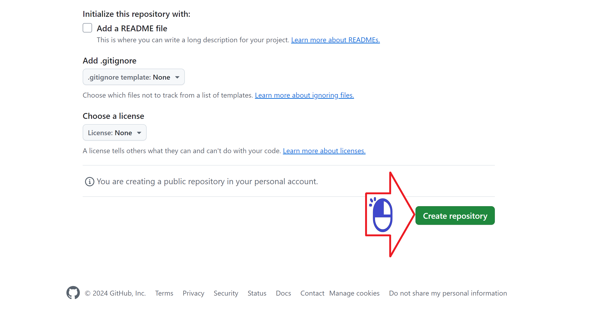
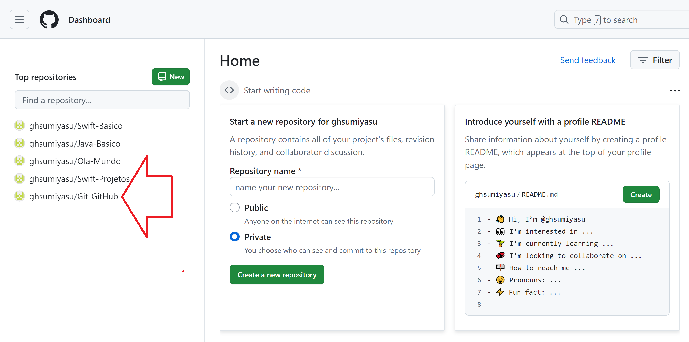

# Repositorio GitHub
Criando um repositorio no GitHub.com

Figura 01 - Buscando o GitHub no Google

Figura 02 - Clique em New

Figura 03 - Digite o nome do Repositorio

Figura 04 - Clique em Create

Figura 05 - Passo a passo para acessar o repositorio no Git

Figura 06 - Repositorio incluido - OK

