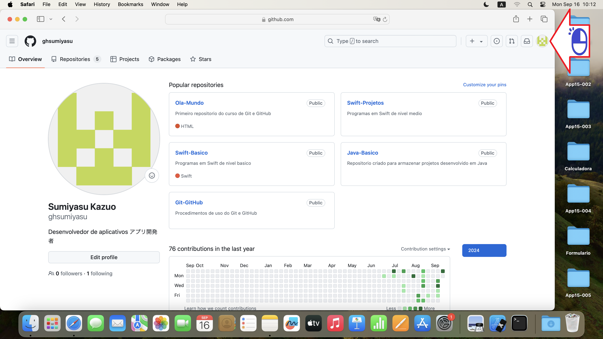
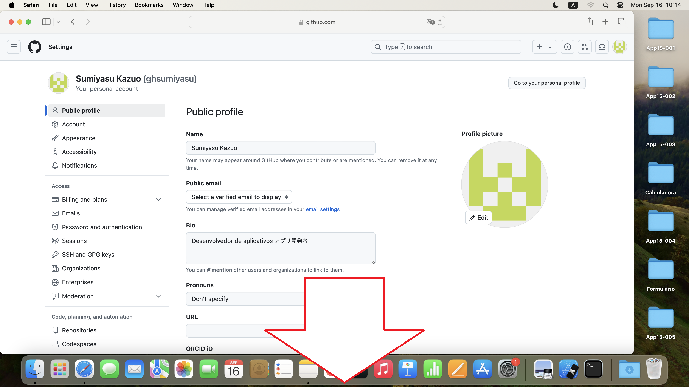
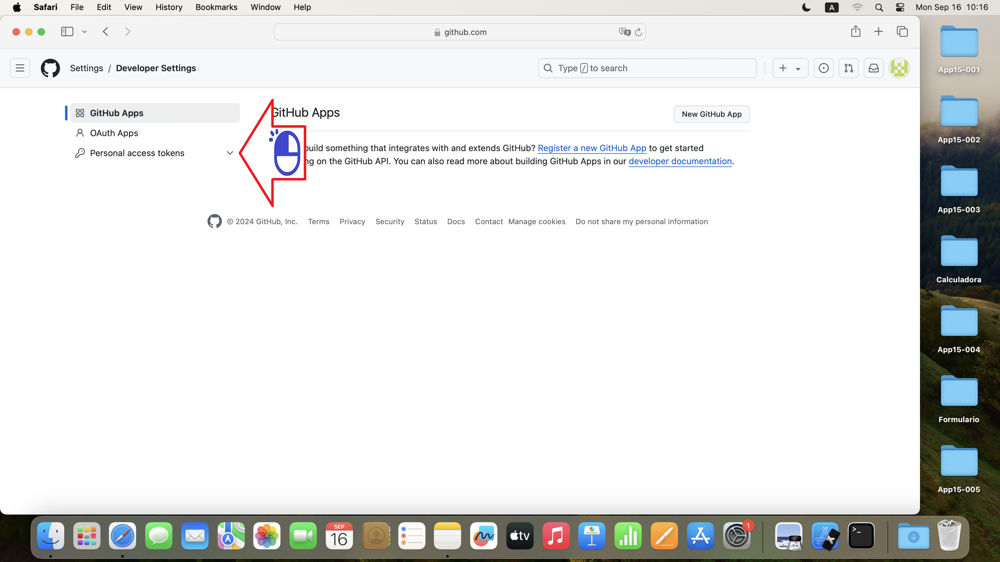
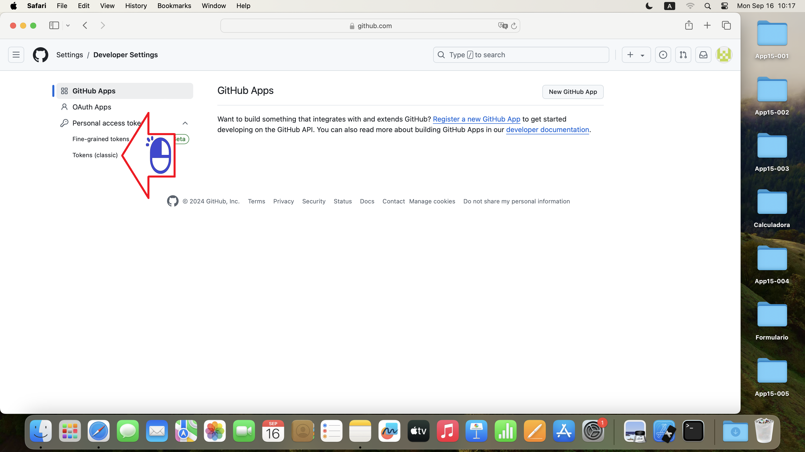
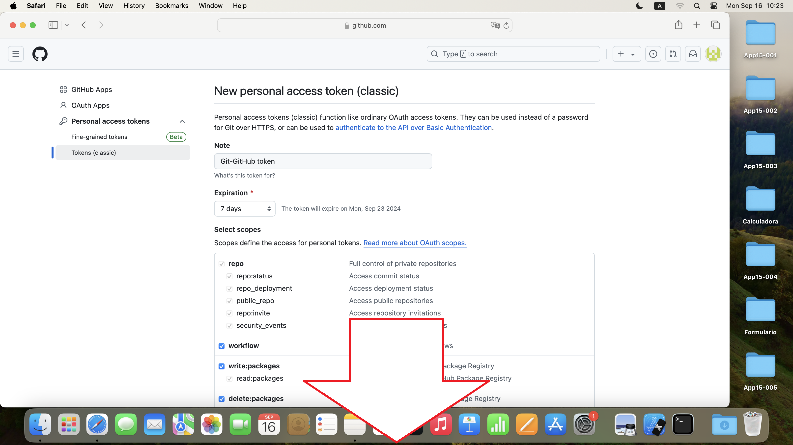
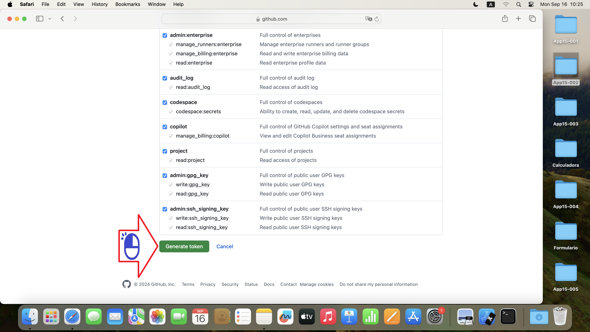

# GitHub Token
Necessario no remoto macOS

Figura 01 - Clique

Figura 02 - Clique Configurações

Figura 03 - Va para baixo

Figura 04 - Clique Configurações de Desenvolvedor

Figura 05 - Clique Acesso Pessoal Tokens

Figura 06 - Clique Tokens (classico)

Figura 07 - Clique Gerar Novo Token

Figura 08 - Clique Gerar Novo Token (Classico)

Figura 09 - Va para o final

Figura 10 - Clique Gerar Token

Figura 11 - Copie o Token

