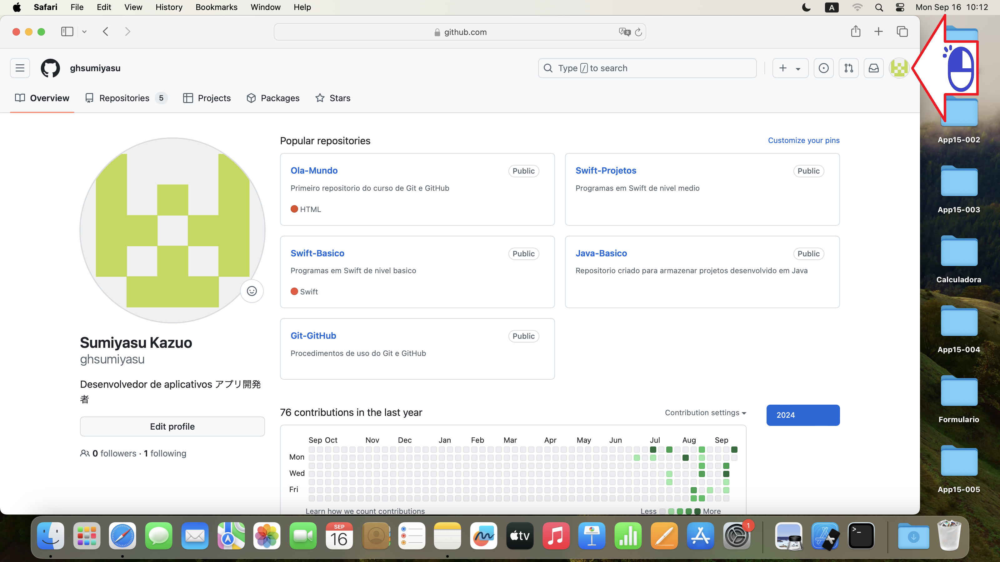
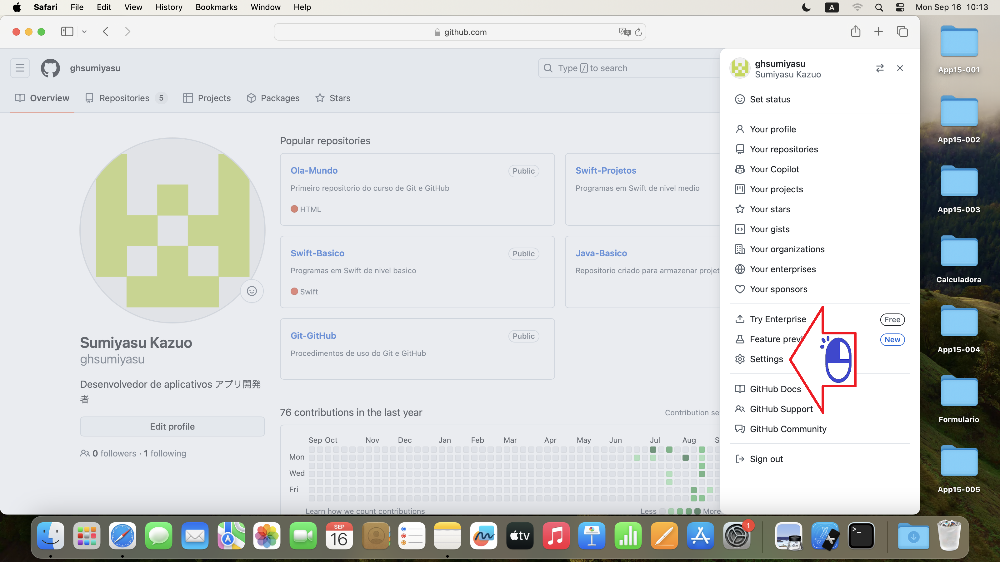
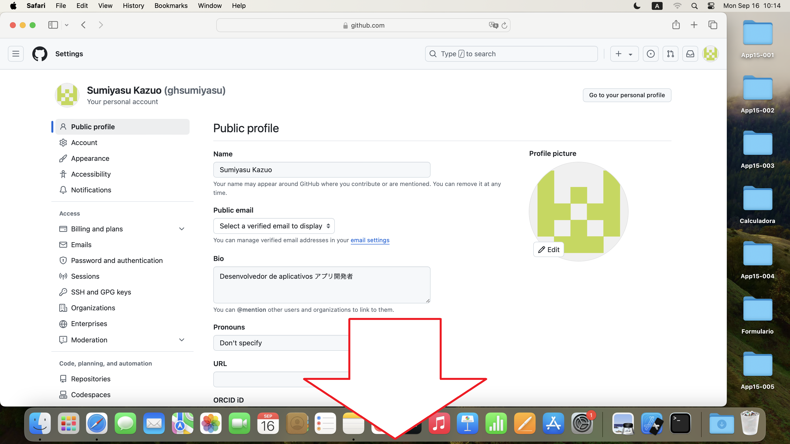
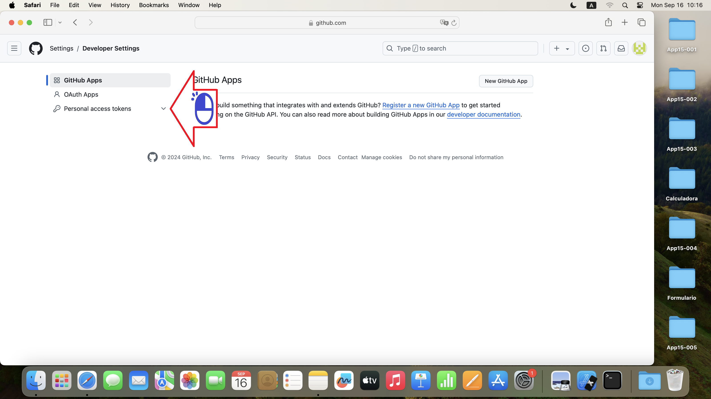
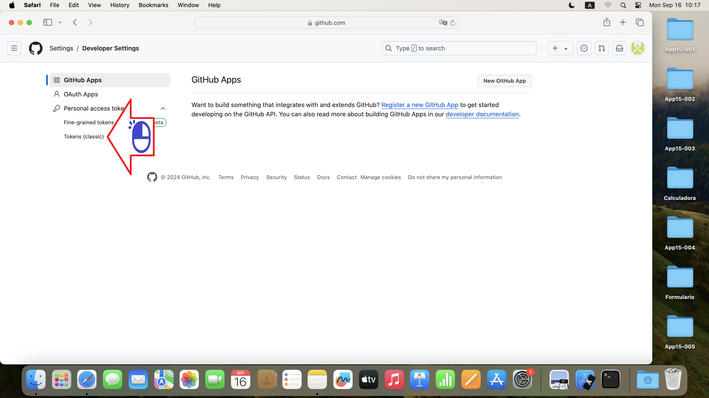
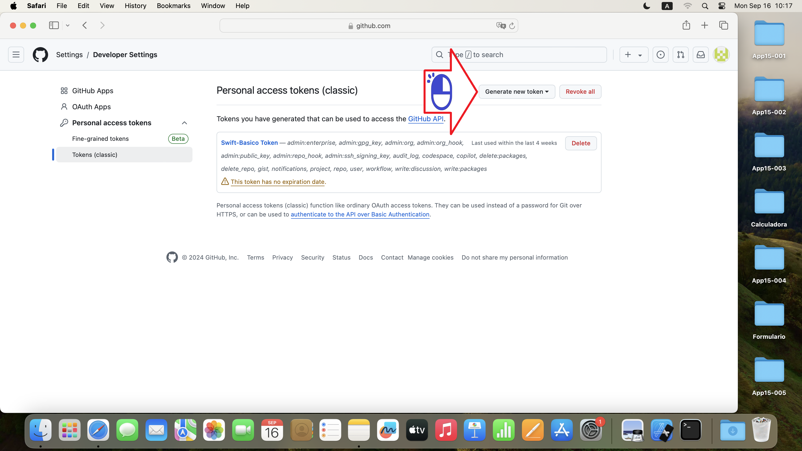
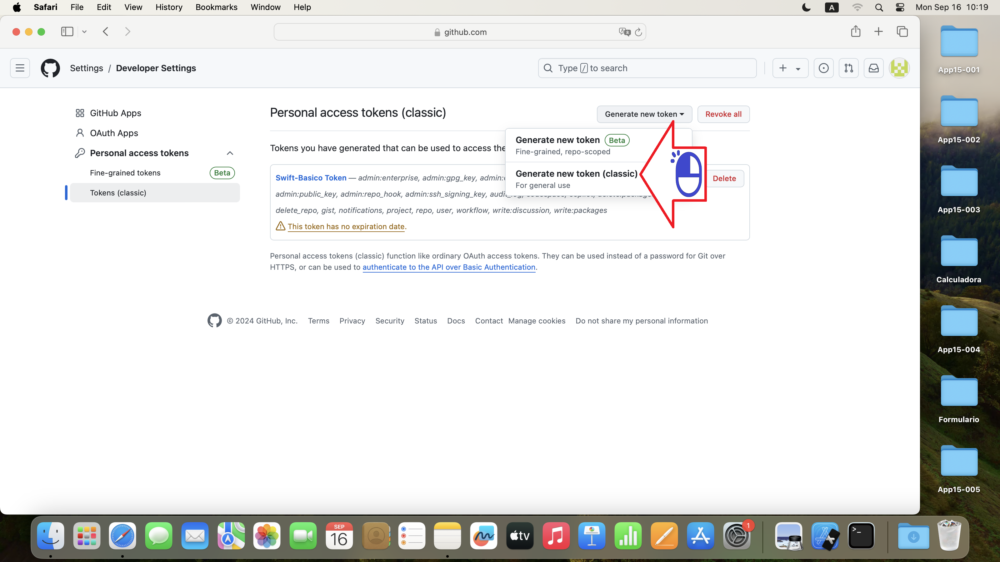
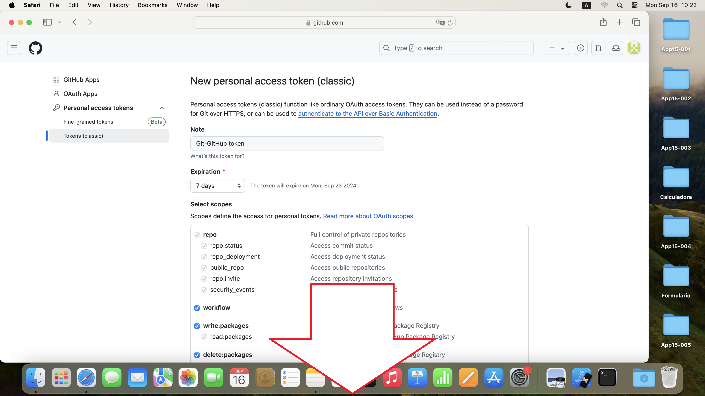
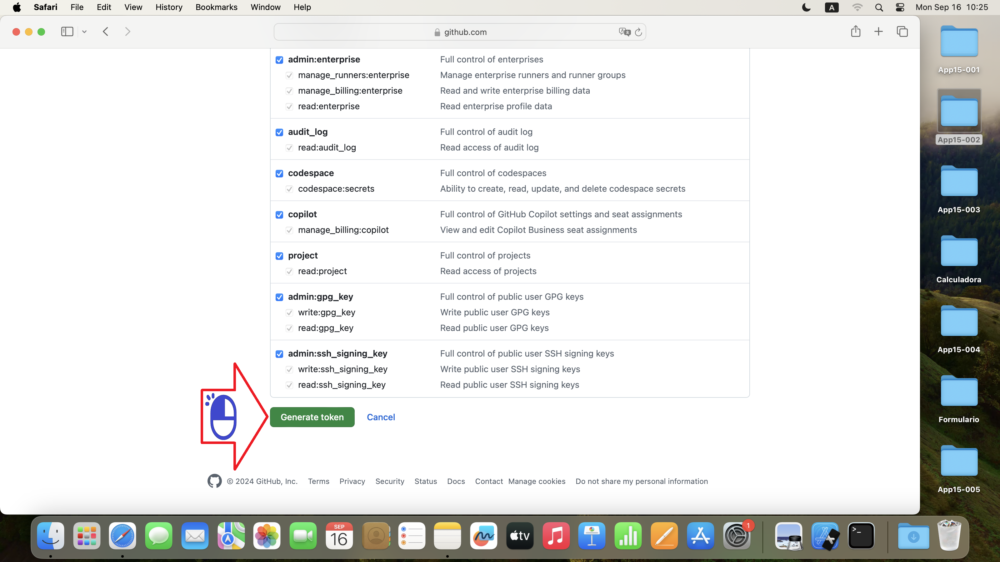
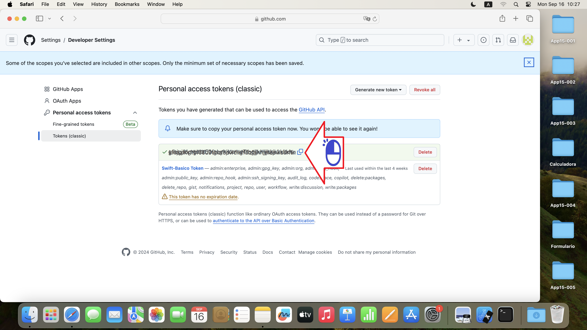

# ギットハブ Token
マックオーエスリモコンが必要です

絵 01 - クリック

絵 02 - 「設定」をクリックします

絵 03 - 下に行く

絵 04 - 「開発者設定」をクリックします

絵 05 - 「パーソナルアクセ Token」をクリックします

絵 06 - 「Tokens」(クラシック)をクリックします 

絵 07 - 「新しいTokenの生成」をクリックします

絵 08 - 「新しいTokenの生成」(クラシック)をクリックします

絵 09 - 最後まで行く

絵 10 - 「Tokenの生成」をクリックします

絵 11 - Tokenをコピーする

