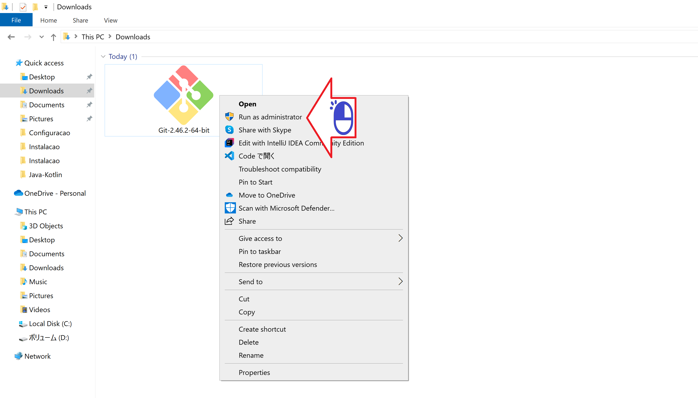
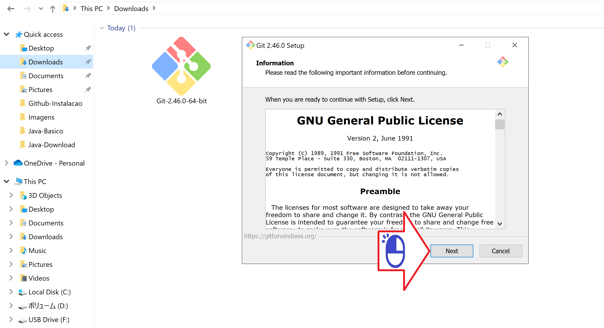
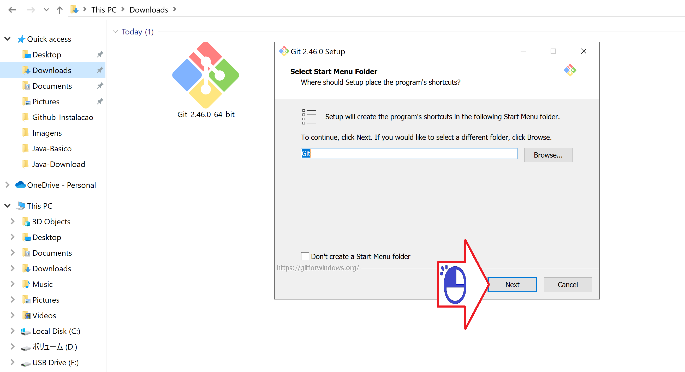
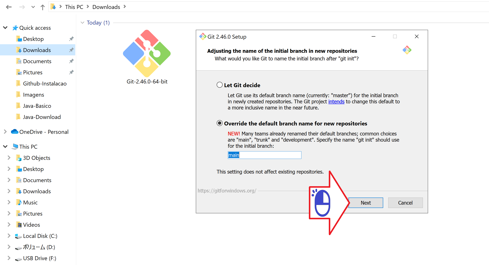
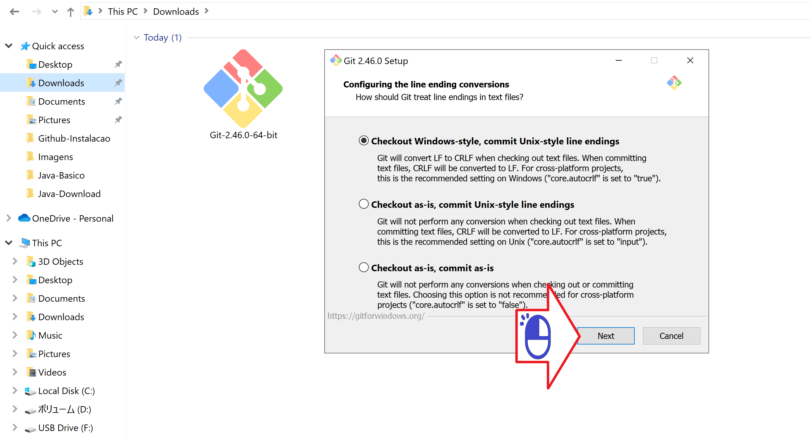
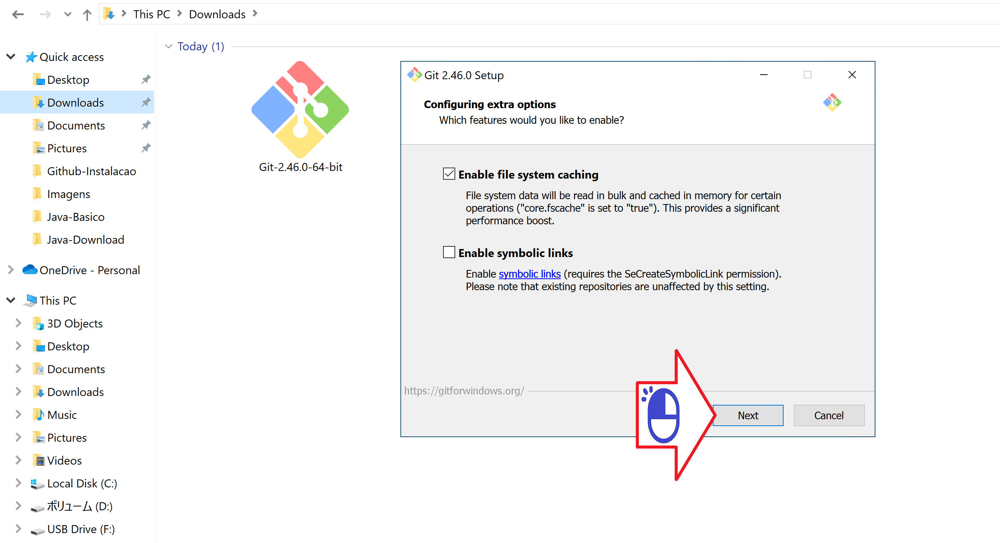
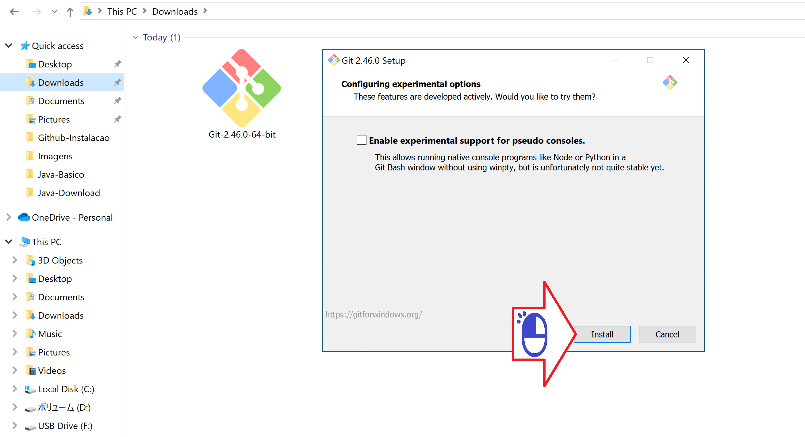
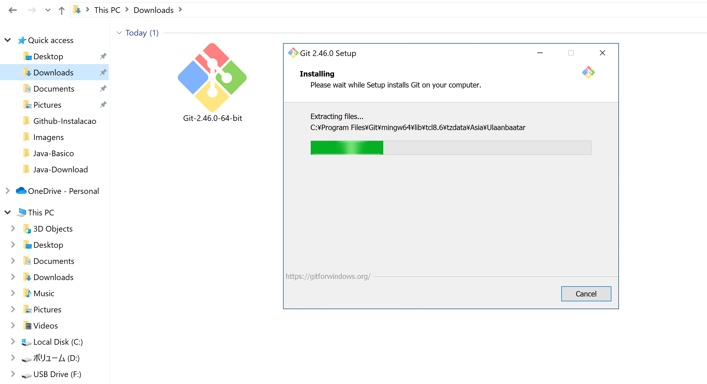

# Instalando o Git
Instalacao do Sistema de versionamento local no Windows

Figura 01 - Clique com o botão direito

Figura 02 - Clique em Run as Administrator

Figura 03 - Clique next

Figura 04 - Clique next

Figura 05 - Clique next

Figura 06 - Clique next

Figura 07 - Recomendo o Visual Studio Code e Clique next

Figura 08 - Clique next

Figura 09 - Clique next

Figura 10 - Clique next

Figura 11 - Clique next

Figura 12 - Clique next

Figura 13 - Clique next

Figura 14 - Clique next

Figura 15 - Clique next

Figura 16 - Clique next

Figura 17 - Clique next

Figura 18 - Aguarde...

Figura 19 - Clique Finish

