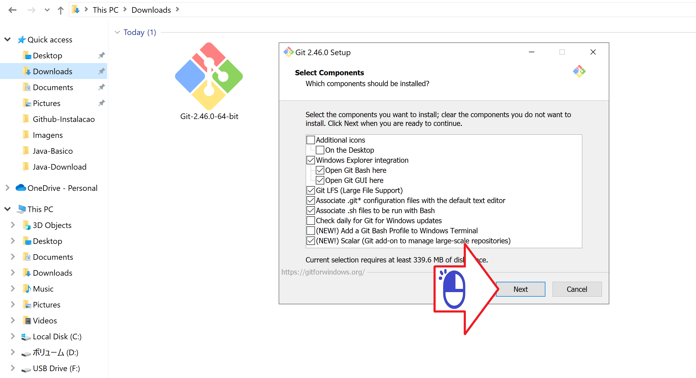
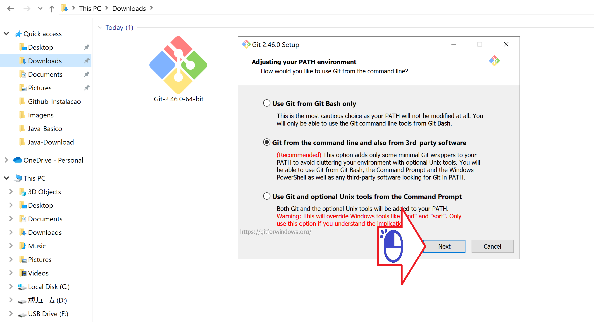
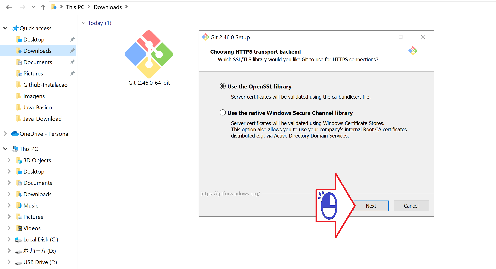
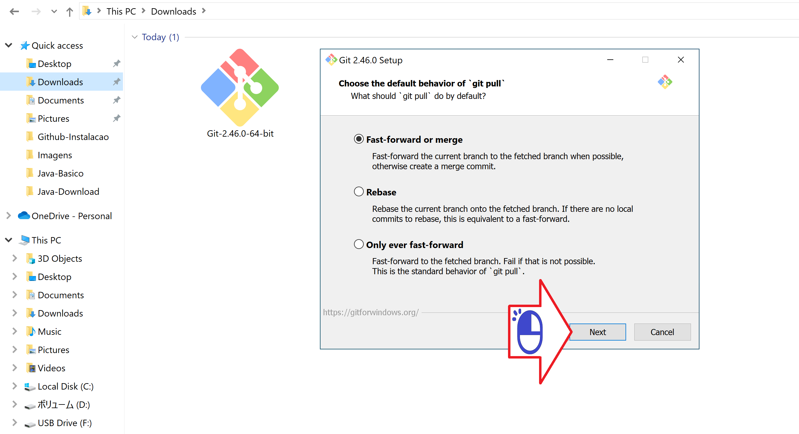

# ギットのインストール
マイクロソフト ウィンドウズへのローカル バージョン管理システムのインストール

絵 01 - インストーラーをダブルクリックします

絵 02 - 「次へ」をクリックします

絵 03 - 「次へ」をクリックします

絵 04 - 「次へ」をクリックします

絵 05 - 「次へ」をクリックします

絵 06 - Visual Studio Code を推奨し「次へ」をクリックします

絵 07 - 「次へ」をクリックします

絵 08 - 「次へ」をクリックします

絵 09 - 「次へ」をクリックします

絵 10 - 「次へ」をクリックします

絵 11 - 「次へ」をクリックします

絵 12 - 「次へ」をクリックします

絵 13 - 「次へ」をクリックします

絵 14 - 「次へ」をクリックします

絵 15 - 「次へ」をクリックします

絵 16 - 「次へ」をクリックします

絵 17 - 待って...

絵 18 - 「完了」をクリックします

