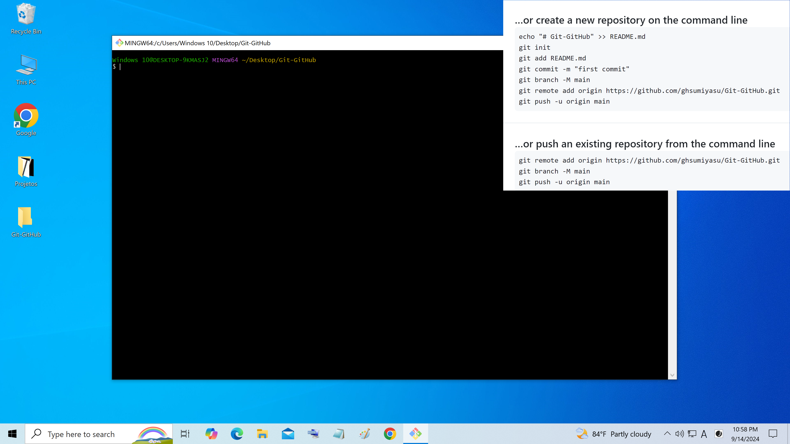
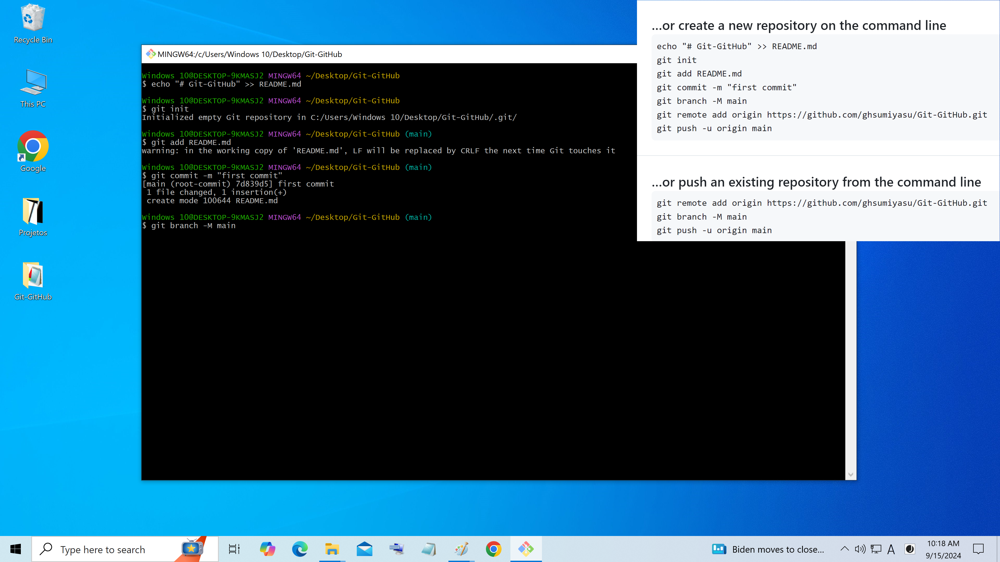
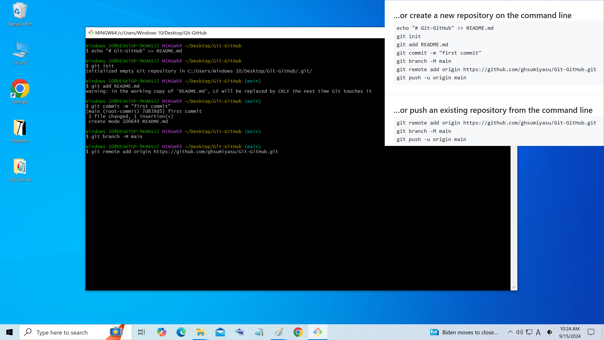
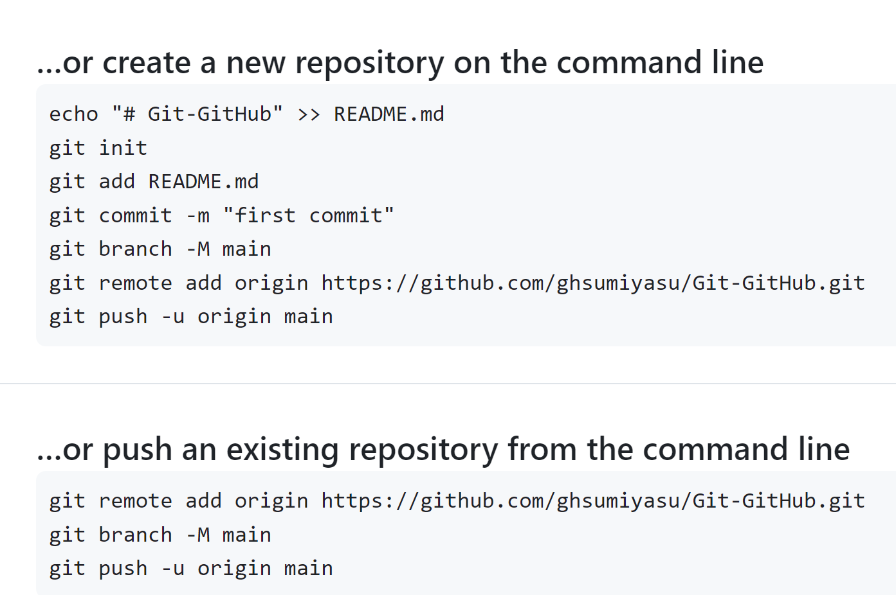

# Repositorio Git
Criando um repositorio local Git

Figura 01 - 1-Clique botão direito 2-Botão esquerdo 3-Botão esquerdo

Figura 02 - Nome do repositorio

Figura 03 - Abra o Git Bash

Figura 04 - Digite

Figura 05 - Digite

Figura 06 - Digite

Figura 07 - Digite

Figura 08 - Digite

Figura 09 - Digite

Figura 10 - Digite

Figura 11 - Digite

Figura 12 - Passo a passo

