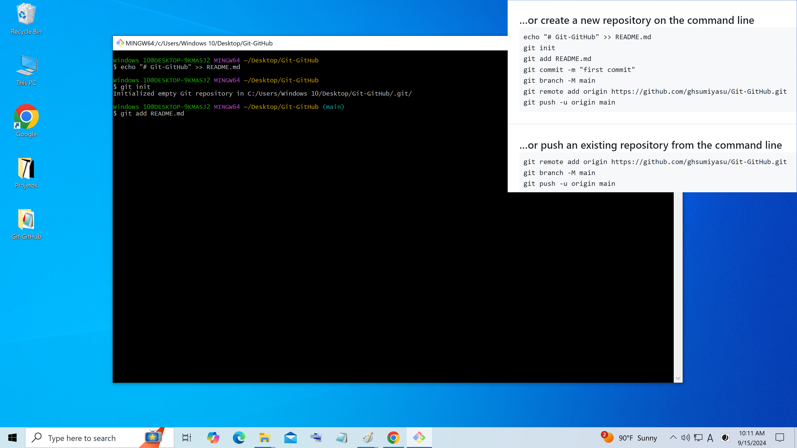

# Gitリポジトリ
ローカル Git リポジトリの作成

絵 01 - 1-右ボタンをクリック 2-左ボタン 3-左ボタン

絵 02 - リポジトリ名

絵 03 - Git Bash を開く

絵 04 - 入力

絵 05 - 入力

絵 06 - 入力

絵 07 - 入力

絵 08 - 入力

絵 09 - 入力

絵 10 - 入力

絵 11 - 入力

絵 12 - 一歩ずつ

