# Repositorio Git
Criando um repositorio local Git no macOS

Figura 01

Figura 02 - Digite Terminal

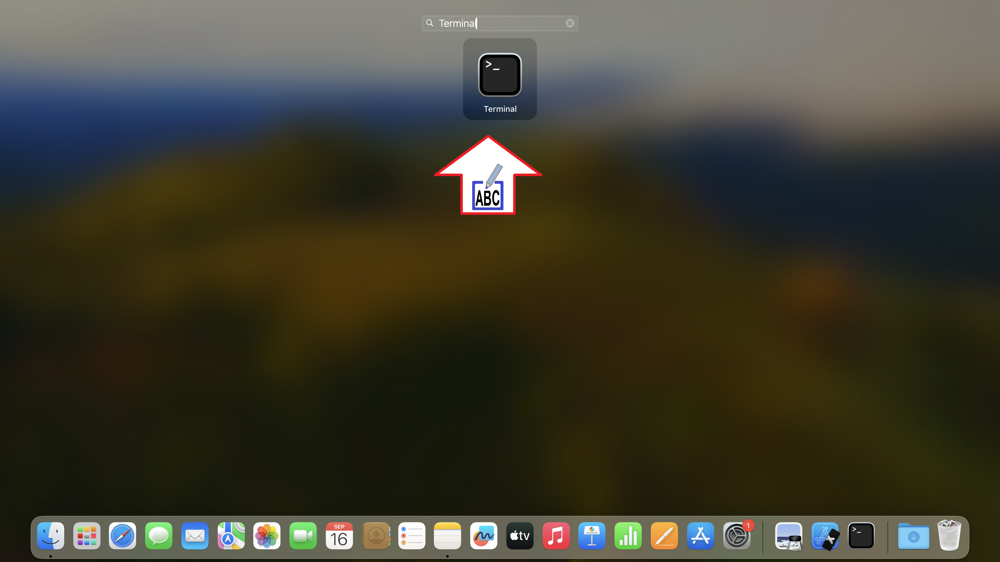

Figura 03

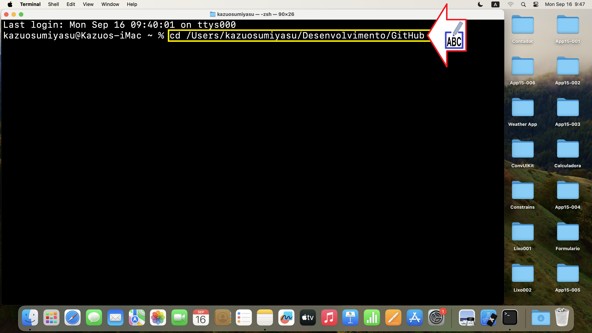

Figura 04

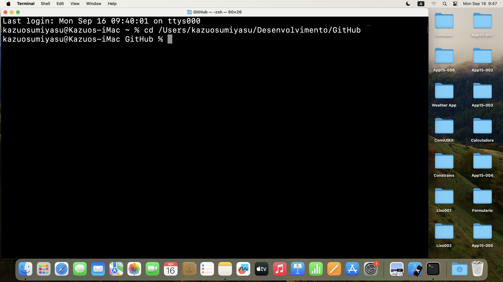

Figura 05

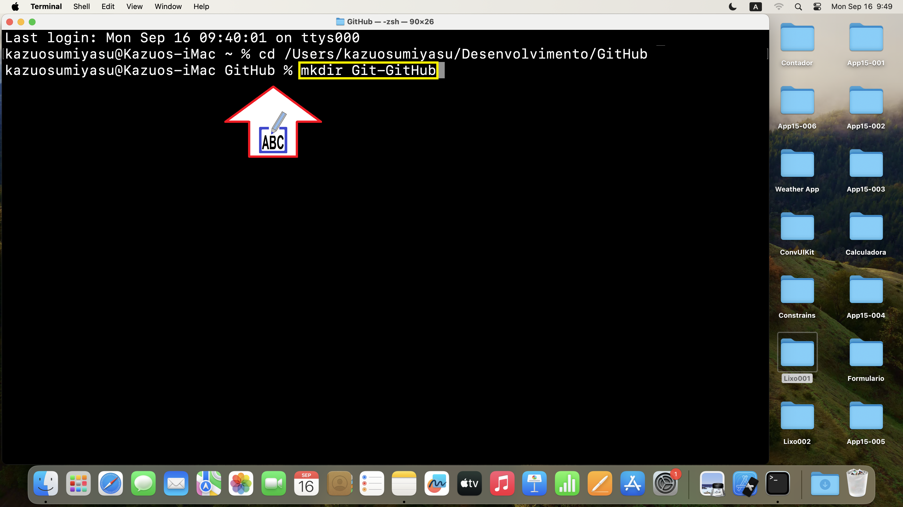

Figura 06

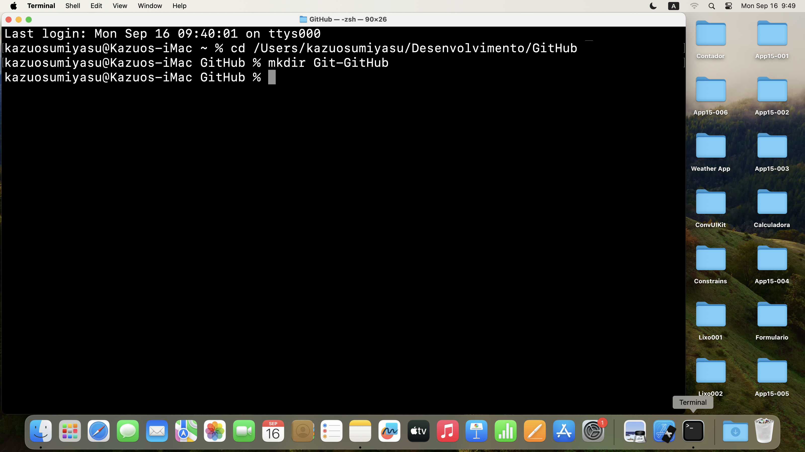

Figura 07

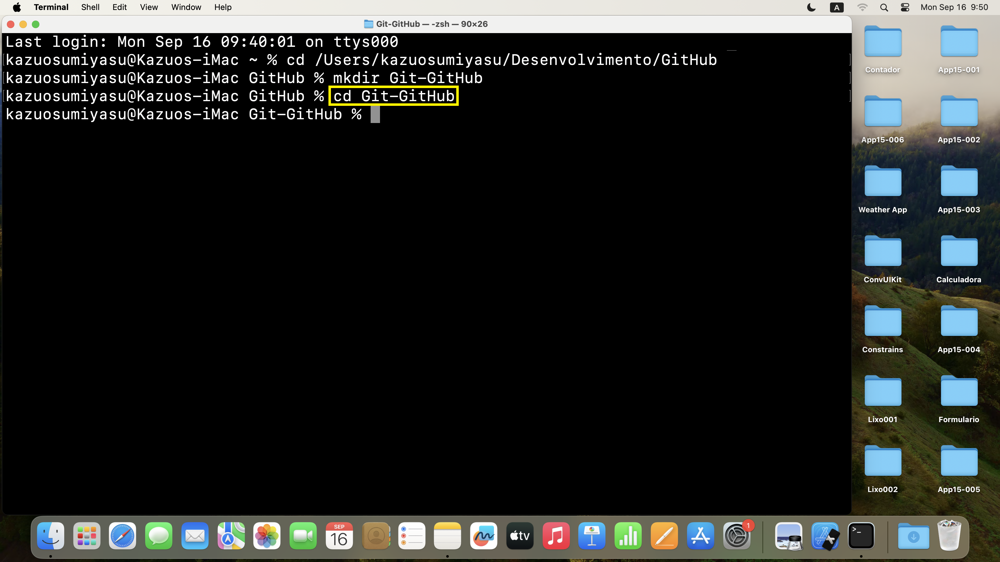

Figura 08

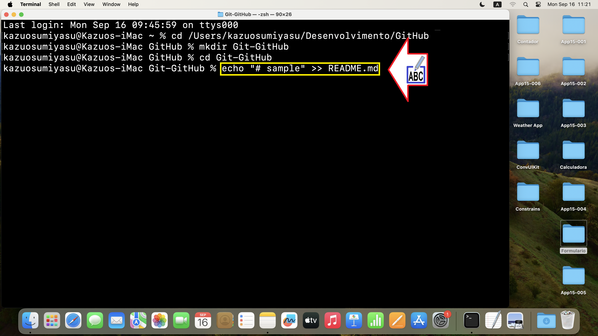

Figura 09

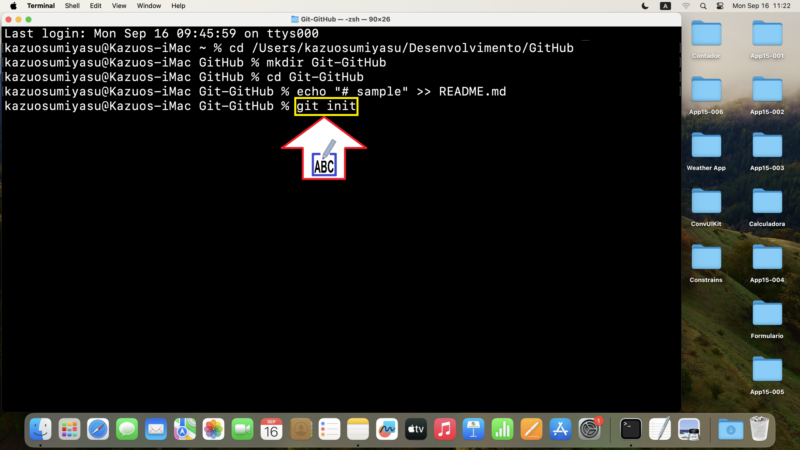

Figura 10

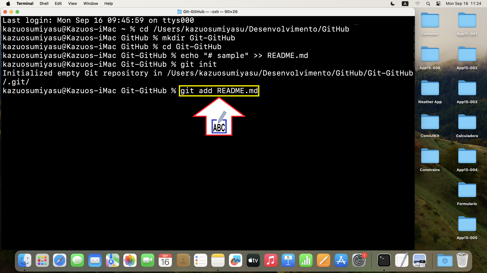

Figura 11

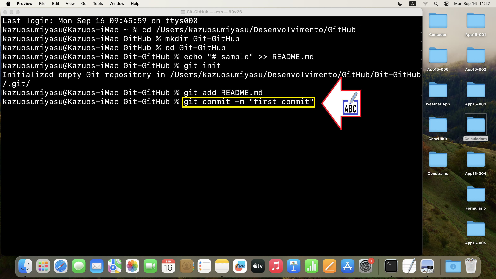

Figura 12

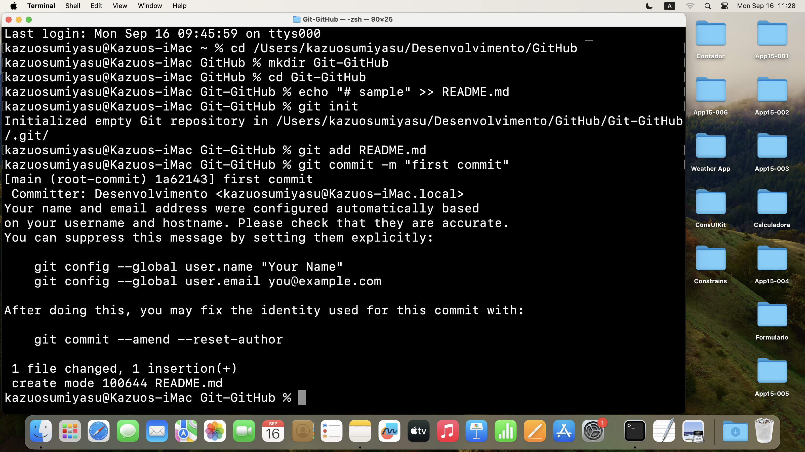

Figura 13

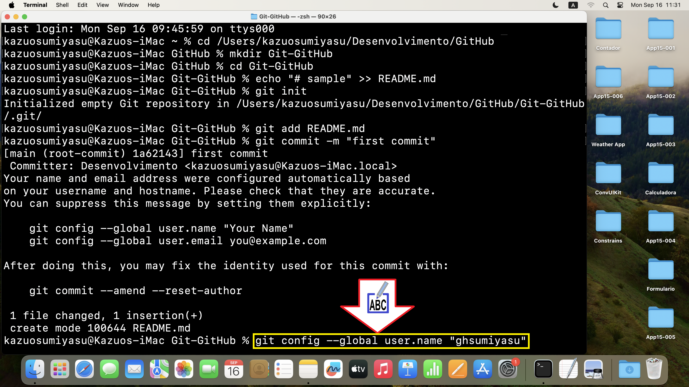

Figura 14

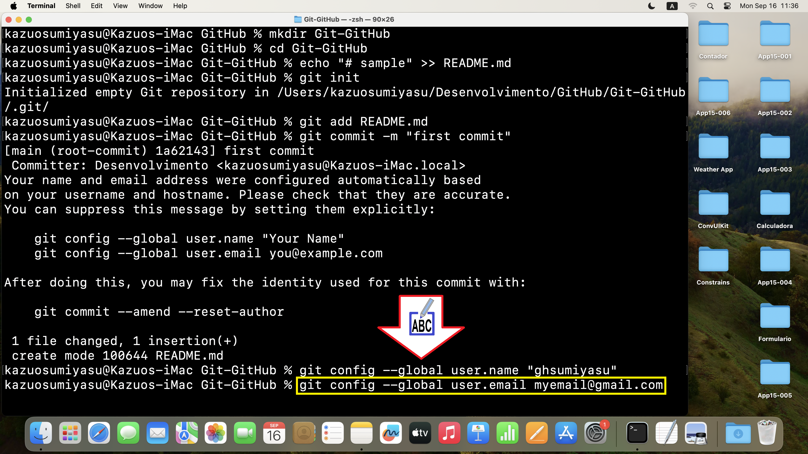

Figura 15

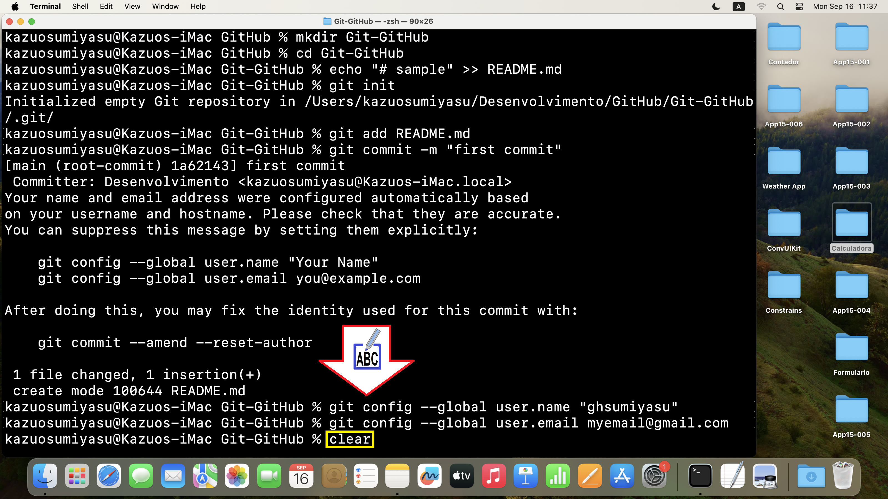

Figura 16

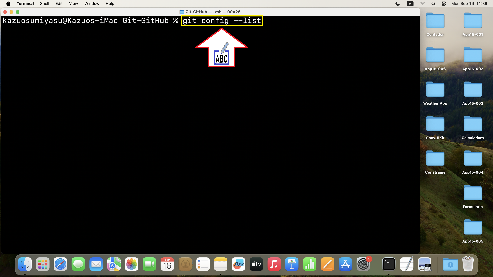

Figura 17 - Digite o Token copiado na conta GitHub

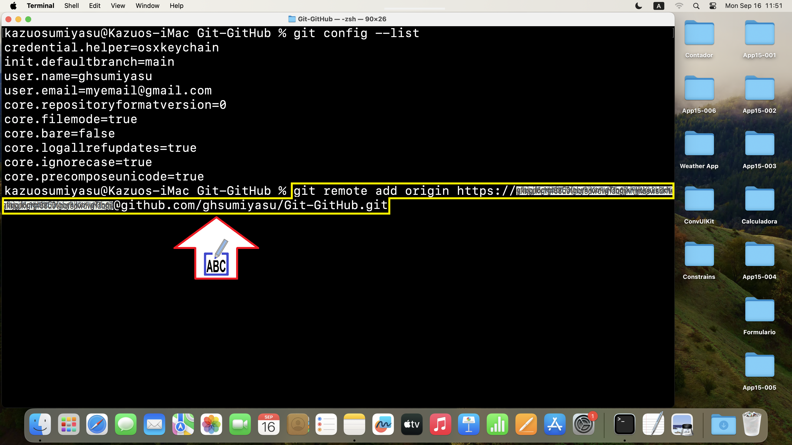

Figura 18

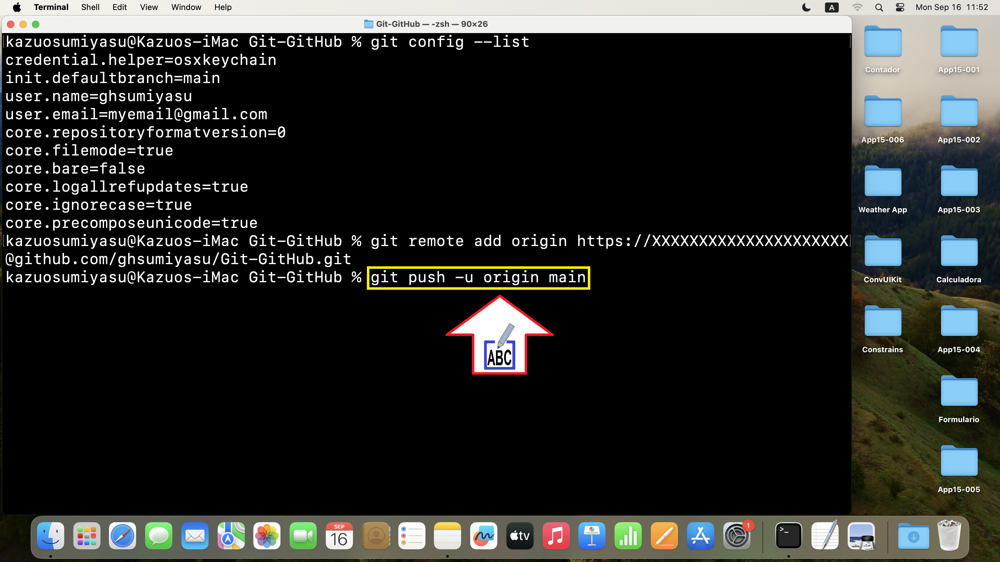