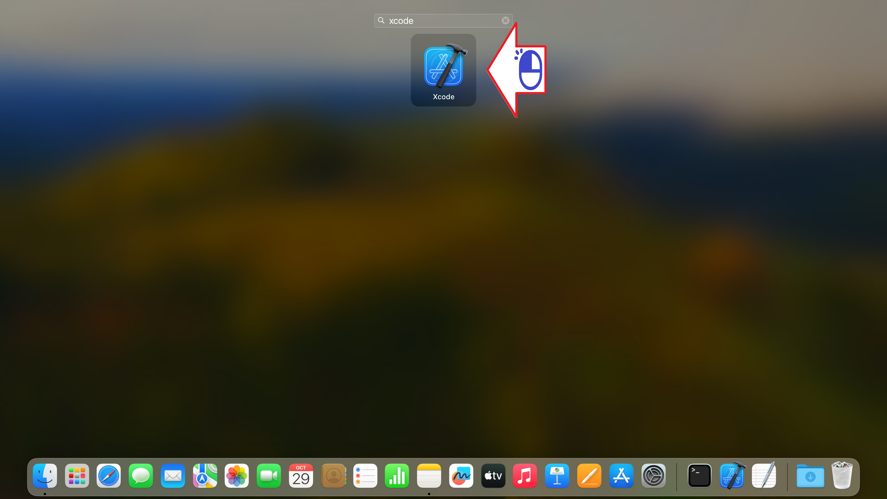
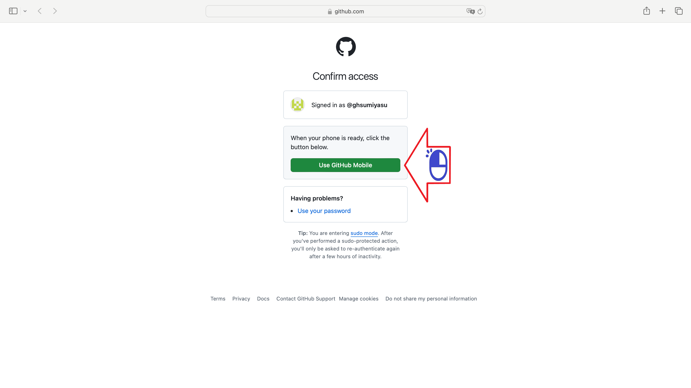
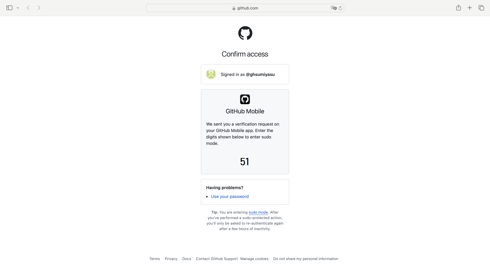
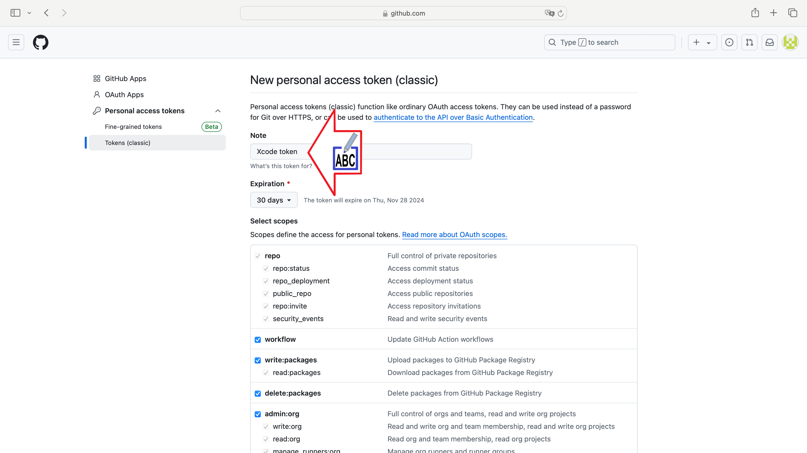
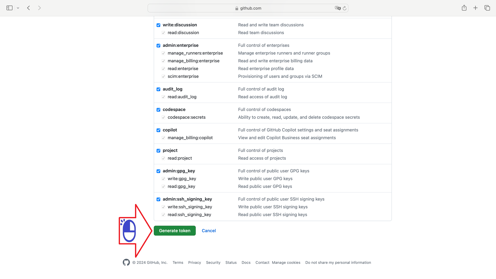
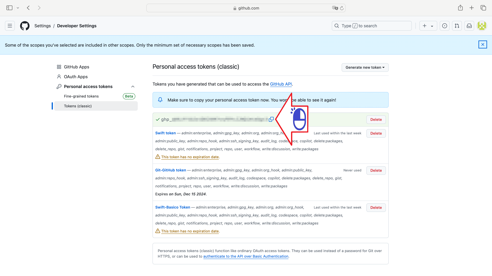
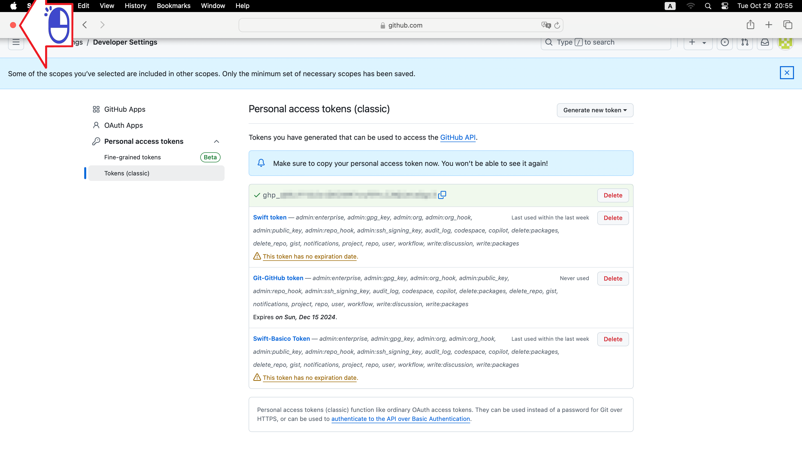

# Xcode Git
Criando um repositorio local Git no Xcode

Figura 01

Figura 02 - Digite e clique Xcode

Figura 03 - Clique botão esquerdo em Xcode

Figura 04 - Clique Configuração

Figura 05 - Clique contas

Figura 06 - Clique GitHub

Figura 07 - Digite GitHub

Figura 08 - Clique em crie um Token no site GitHub

Figura 09 - Verifique o aplicativo Github no smartphone

Figura 10 - Confirme o numero no smartphone

Figura 11 - Digite a descrição do token

Figura 12 - Clique em Gerar o token

Figura 13 - Copie o token

Figura 14 - Saia do browser

Figura 15 - Cole o token

Figura 16 - Clique Colar

Figura 17 - Clique Sign in

Figura 18 - Clique em Source Control

Figura 19 - Clique Git

Figura 20 - Digite seu id e email GitHub e volte para o projeto

