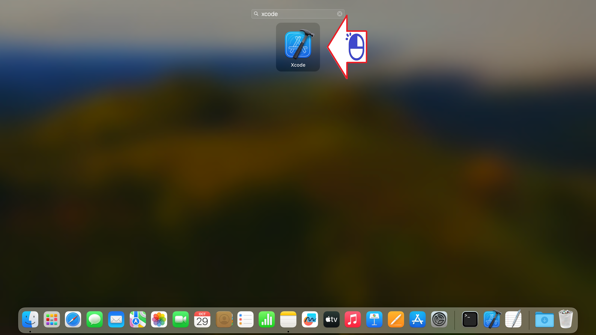
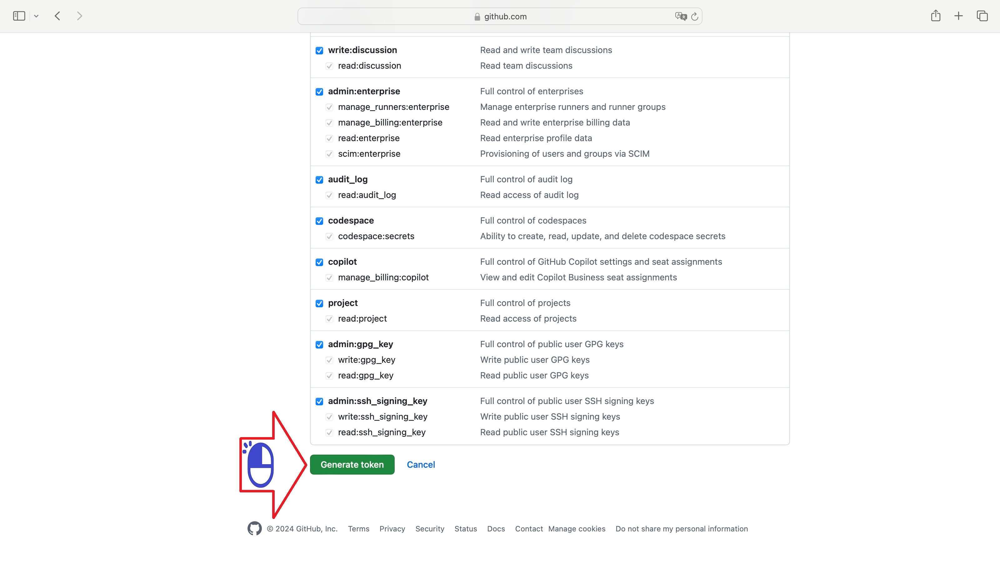
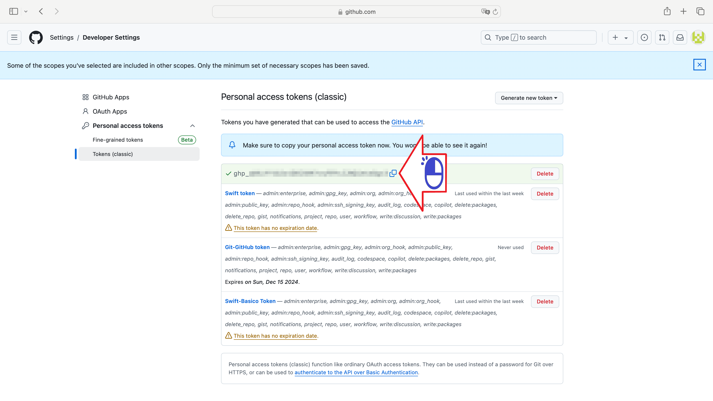

# ギットとエックスコード
エックスコードでギットを使用する

絵 01

絵 02 - 「エックスコード」と入力してクリックします

絵 03 - エックスコードで左クリック

絵 04 - 「構成」をクリックします

絵 05 - アカウントと(+)記号をクリックしてギットハブアカウントを追加します

絵 06 - 「ギットハブ」をクリックして続行します

絵 07 - ギットハブに入る

絵 08 - ギットハブサイトで「トークンの作成」をクリックします。

絵 09 - スマホでギットハブアプリを確認する

絵 10 - スマホで番号を確認する

絵 11 - トークンの説明を入力してください

絵 12 - 「トークンの生成」をクリックします

絵 13 - トークンをコピーする

絵 14 - ブラウザを終了します

絵 15 - トークンを貼り付けます

絵 16 - 「貼り付け」をクリックします

絵 17 - 「サインイン」をクリックします

絵 18 - 「ソース管理」をクリックします

絵 19 - 「ギット」をクリックします

絵 20 - ギットハブアイディーとメールアドレスを入力してプロジェクトに戻ります

