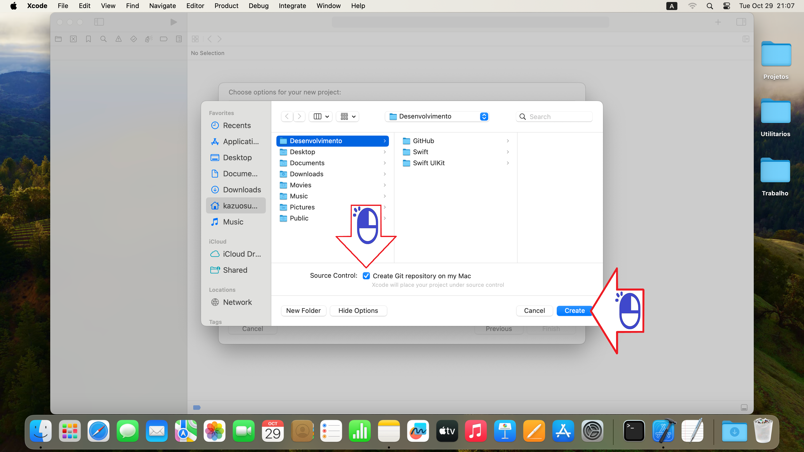
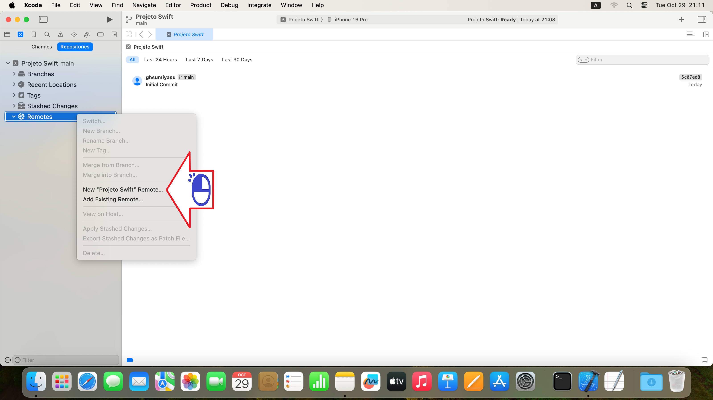
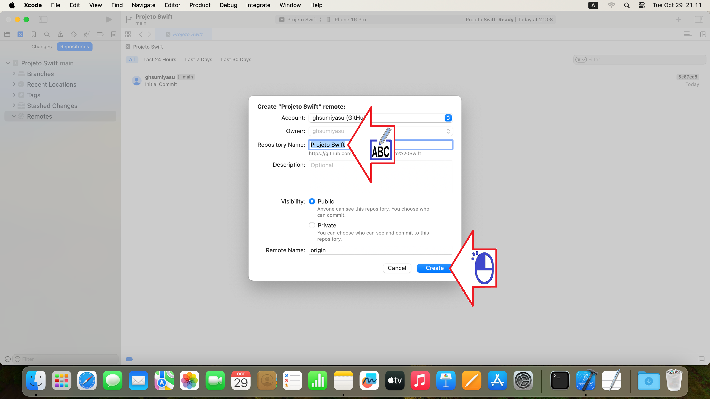

# Xcode Projeto
Colocando um projeto Xcode no GitHub

Figura 01 - XXXXXXXXXXXXX

Figura 02 - XXXXXXXXXXXXX

Figura 03 - XXXXXXXXXXXXX

Figura 04 - XXXXXXXXXXXXX

Figura 05 - XXXXXXXXXXXXX

Figura 06 - XXXXXXXXXXXXX

Figura 07 - XXXXXXXXXXXXX

Figura 08 - XXXXXXXXXXXXX

Figura 09 - XXXXXXXXXXXXX

