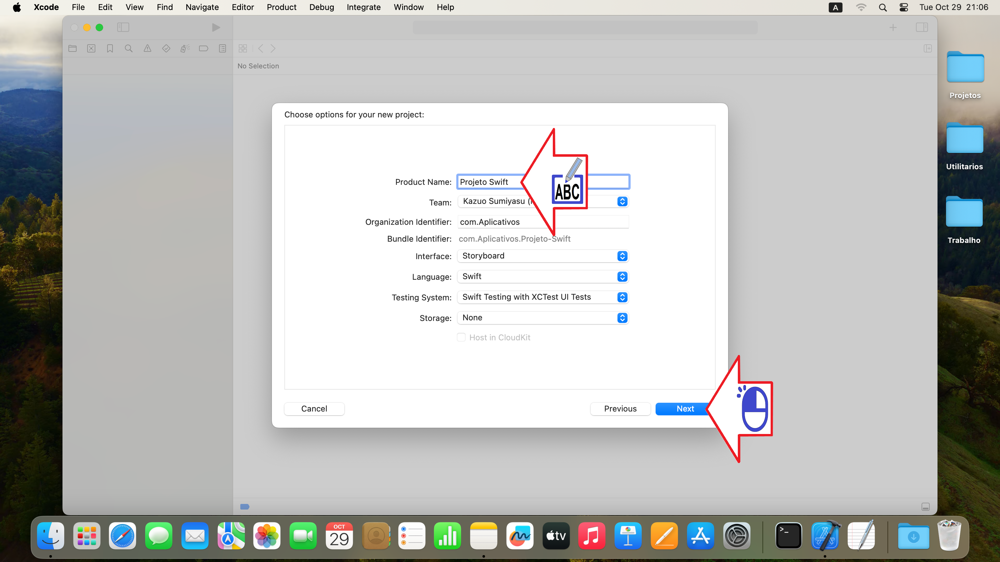
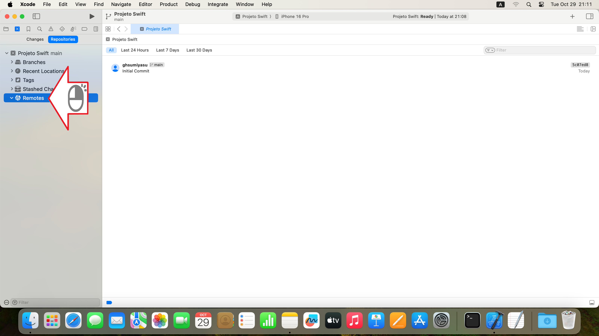

# Xcode Projeto
Colocando um projeto Xcode no GitHub

Figura 01 - Clique App e Next

Figura 02 - Digite o nome do projeto e clique Next

Figura 03 - Marque a opção Crie o repositorio e clique Create

Figura 04 - Clique no icon repositorio

Figura 05 - Clique em repositorios

Figura 06 - Clique na marca (>) para abrir as opções

Figura 07 - Clique com o esquerdo Remotes

Figura 08 - Clique em New "Projeto Swift" Remote...

Figura 09 - Digite o nome do projeto e clique Create

