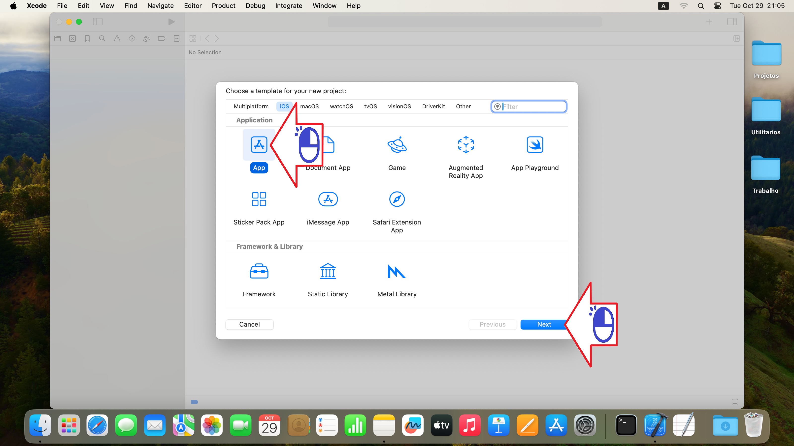
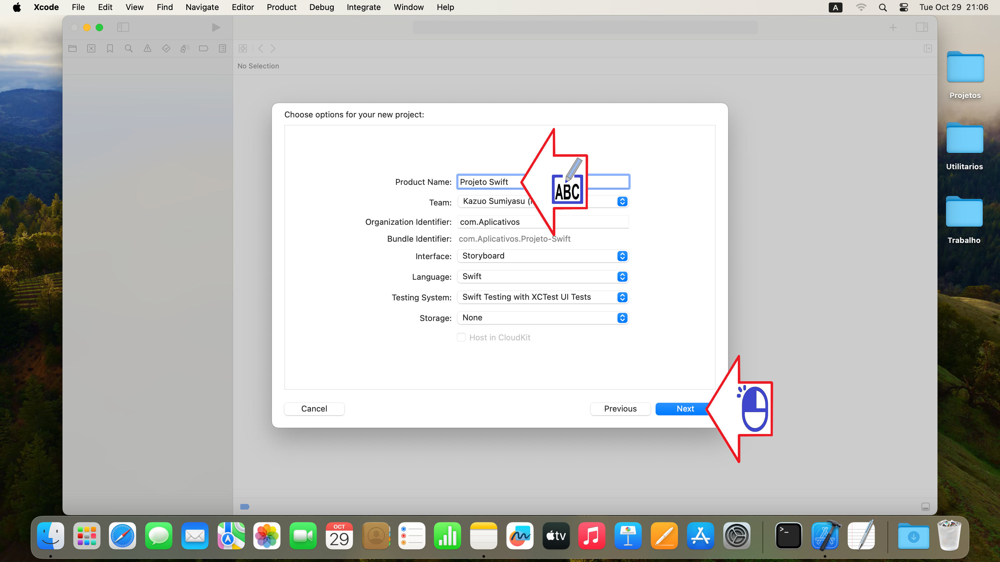
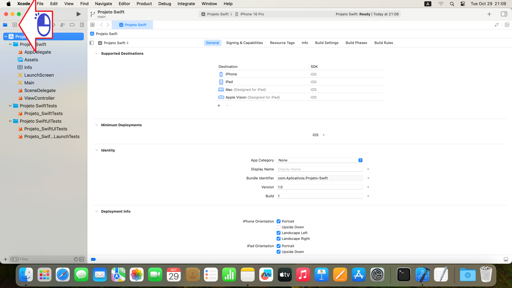
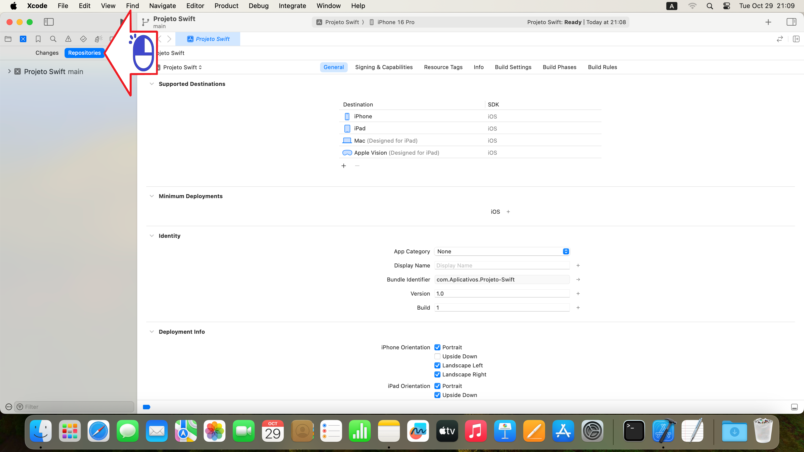
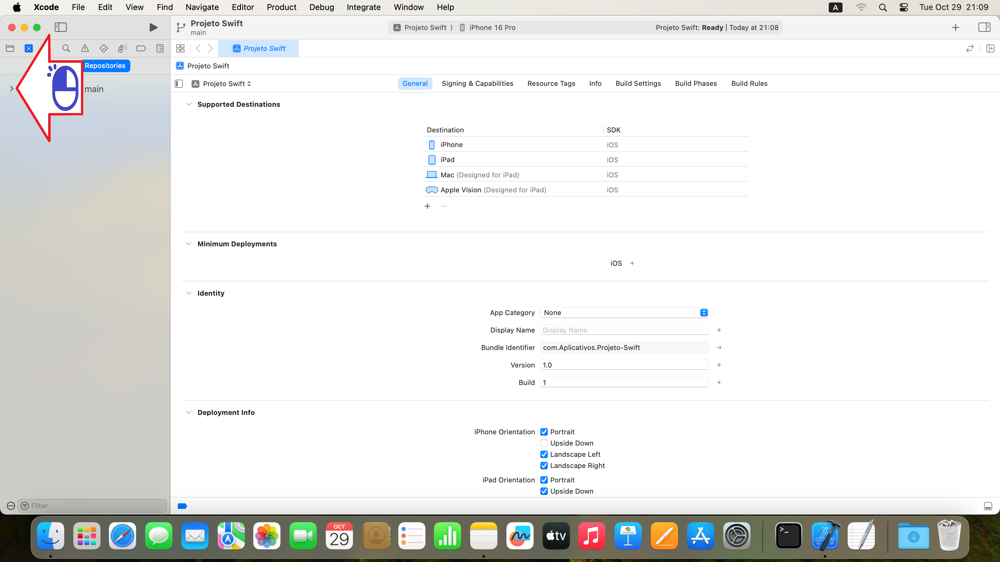
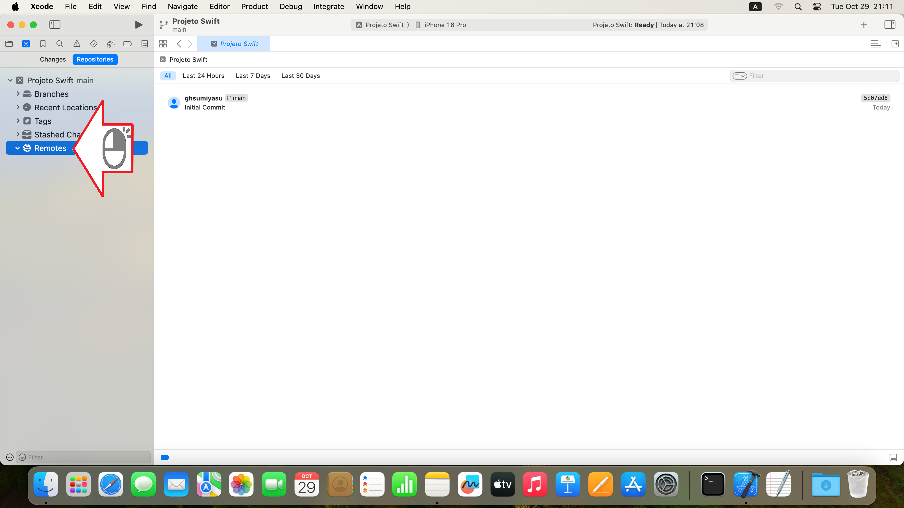
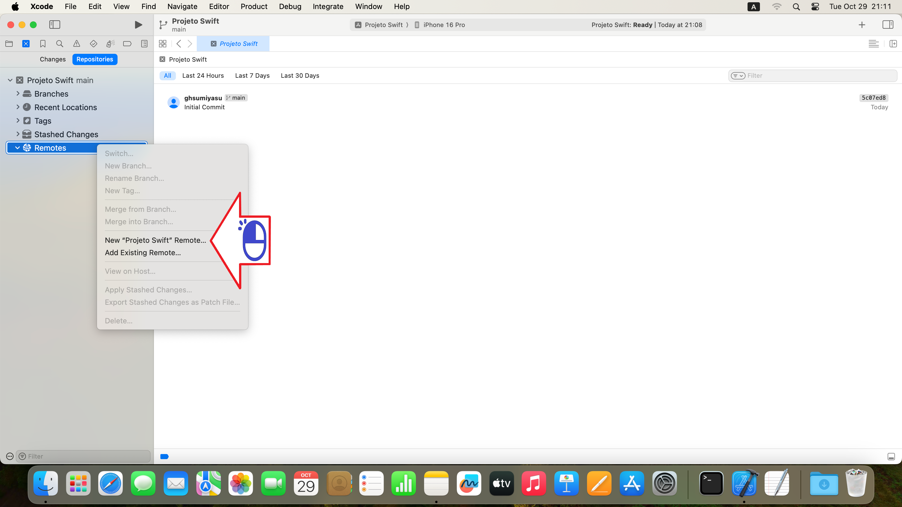
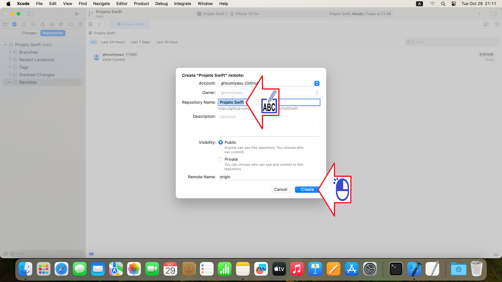
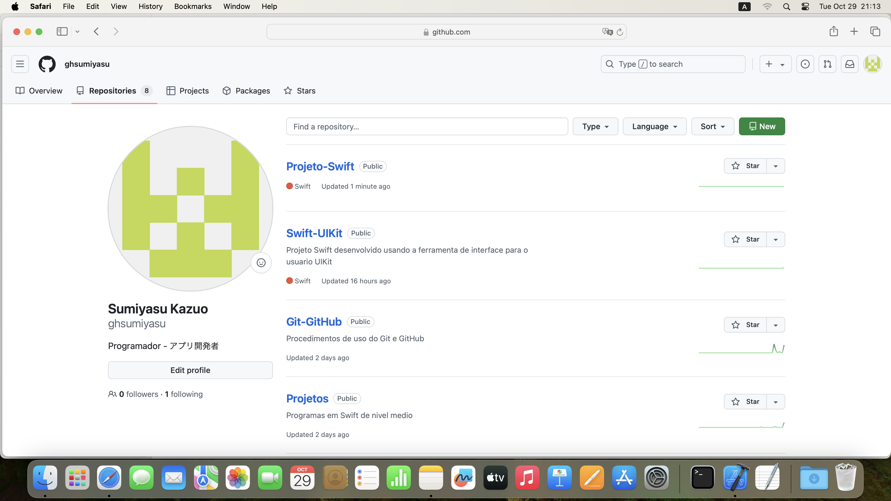

# エックスコードプロジェクト
エックスコードプロジェクトをギットハブにアップロードする

Figura 01 - 「アプリ」をクリックして「次へ」をクリックします

Figura 02 - プロジェクト名を入力し、「次へ」をクリックします

Figura 03 - 「リポジトリの作成」オプションを選択し「作成」をクリックします。

Figura 04 - リポジトリアイコンをクリックします

Figura 05 - リポジトリをクリックします

Figura 06 - マーク (>) をクリックしてオプションを開きます

Figura 07 - リモコンを左クリックします

Figura 08 - 新しい「スウィフトプロジェクト」リモート...をクリックします

Figura 09 - プロジェクト名を入力し「作成」をクリックします。

Figura 10 - ギットハブのリポジトリ

